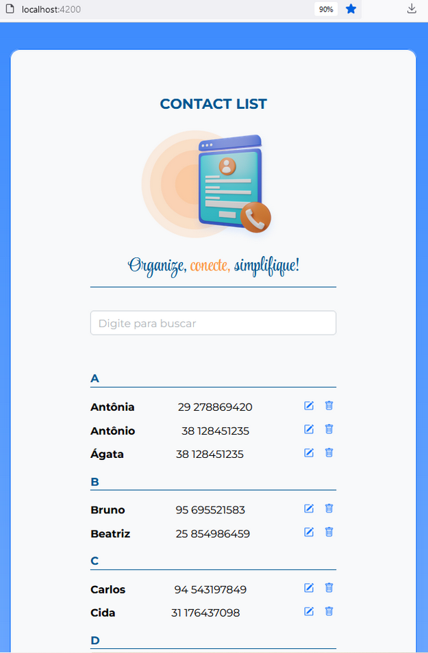

# Projeto Lista de Contatos Angular

Contact List é uma aplicação Angular de gerenciamento de contatos, que permite o usuário ...


## Como rodar a aplicação Angular

1. **Clone o repositório:**
  ```bash
    git clone https://github.com/cidaluna/angular-contact-list.git
  ```

2. **Navegue no diretório principal**
  ```bash
    cd angular-contact-list
  ```

3. **Execute o comando**
  ```bash 
    npm install
  ```

4. **Execute a aplicação Angular**
  ```bash 
    ng serve
  ```

5. **Navegue na URL que o comando anterior apresentou**

  Em seguida, a aplicação estará disponível em: http://localhost:4200

## Data Binding

Processo onde o Angular sincroniza os dados entre a classe dos componentes e as views (template).

### 1. Interpolação `{{ valor }}`

 Substitui o {{ nome }} pelo valor da variável ou da propriedade diretamente no template HTML.

 Exemplo:

 ```html
  <p>Olá, {{ nome }}!</p>
 ```

 ```typescript
  export class MeuComponente {
    nome = 'Cida Luna';
  }
```

### 2. Property Binding `[propriedade]="valor"`

Vincula uma propriedade do elemento HTML `src` a uma propriedade da classe do componente `urlDaImagem`. Permitindo valores dinamicamente no template.

Exemplo:

  ```html
  
  ```

```typescript
  export class MeuComponente {
    urlDaImagem = 'http://meusite.com/imagem01.png';
  }
```

### 3. Event Binding `(evento)="metodo()"`

 Permite ouvir eventos praticados pelo usuário no DOM (como cliques, entradas de teclado, movimentos do mouse, toques na tela, etc) e reagir a eles na classe do componente, ou seja, podemos definir ações (como navegação, envio de formulários, exibição de mensagens, etc) a serem executadas quando um evento específico ocorrer.

 Exemplo:

 ```html
  <button (click)="clicouNoBotao()">Teste</button> 
```

```typescript
  export class MeuComponente {
    clicouNoBotao() {
      alert('Você clicou no botão teste!');
    }
  }
```

### 4. Two-way Binding `[(ngModel)]="propriedade"`

Combina Property Binding e Event Binding para criar uma via de mão dupla entre a classe e o template. Ou seja, mudanças no campo de entrada do HTML atualiza a propriedade na classe e vice-versa, representando uma sincronização em tempo real de entrada de dados.

Exemplo:

```html
  <input [(ngModel)]="nomeUsuario" placeholder="Digite seu nome"/>
  <p>Direção do .ts para o HTML</p>
  <p>Input inicializado com o valor definido no .ts</p>
```

```html
  <input [(ngModel)]="nomeDigitado" placeholder="Digite seu nome"/>
  <p>Direção do HTML para o .ts</p>
  <p>Input aguardando o valor ser digitado na tela HTML. Nome digitado = {{ nomeDigitado }}</p>
```

```typescript
  export class MeuComponente {
    nomeUsuario: string = 'Cida Luna';
    nomeDigitado: string = '';
  }
```


## Screenshots

Tela da aplicação Lista de Contatos em Angular:


